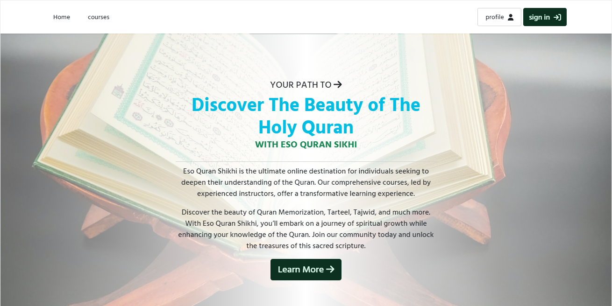
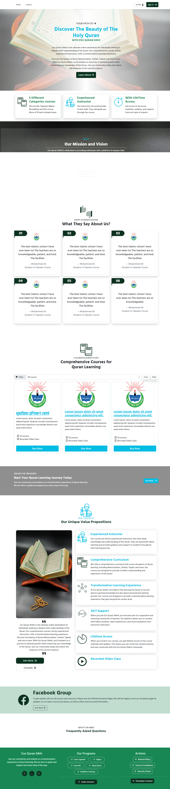
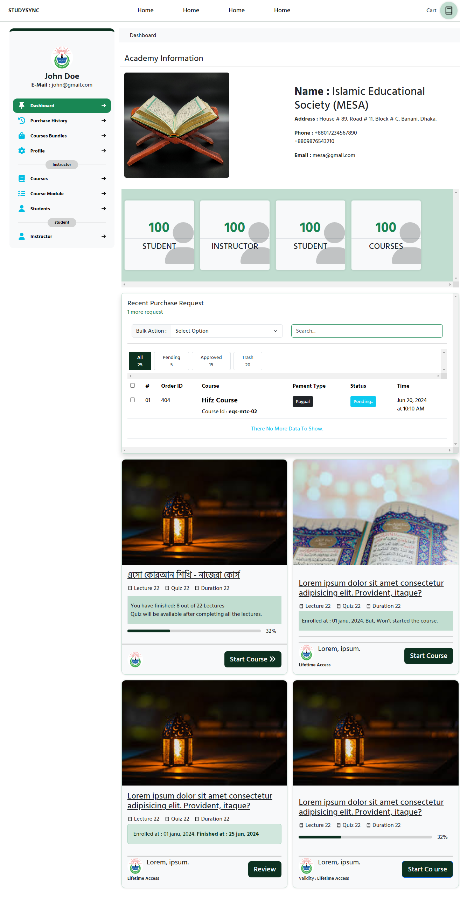

    

<h1 align="center">Welcome to the EQS !</h1>

<h3 align="center">
EQS [Eso Quran Sikhi]  is a private Quran Learning platroms in Bangladesh. This is there client side source code included Html and CSS (simplified). 
  
</h3>

<!-- license -->
  
  <!-- follower on x -->
  <a href="https://twitter.com/intent/follow?screen_name=eqsimulator" >
    imulator.svg?style=social&label=Follow"/>
  </a>

# Disscover The Beauty of The Holy Quran
#### Discover the beauty of Quran Memorization, Tarteel, Tajwid, and much more. With Eso Quran Shikhi, you’ll embark on a journey of spiritual growth while enhancing your knowledge of the Quran. Join our community today and unlock the treasures of this sacred scripture.

EQS is a web application that provides educational resources for learning and understanding the Holy Quran, Sunnah and Hadith.
EQS is an educational tool that allows users to study and learn about the Holy Quran and continu there online courses.

# About The Project
* This project is a simple web application that provide users . It's built with [Laravel](https://laravel.com) and [Livewire](https://livewire.laravel.com).
* This is a project that was created by [@Zubair](http://github.com/aizubair21) a Full Stack Laravel Developer.

# Feature
* User Authentication
* Authorization
*  CRUD Operations (Create, Read, Update and Delete)
* Responsive Design 
* Search Bar for searching verses or chapters
* Student, Instractor and Administrator Login
* Multi Instructor (Vendor) application
* Interactive Images with zooming effect
* Audio Recitation in various languages
* PDF Downloadable Files
* Dark Mode Theme

## Live Demo
[Live Demo Link from Github ]()

## Built With / Technologies Used

 * **Frontend :** Livewire for spa, Bootstrap, Tailwing CSS,  AlpineJS and Laravel-Blade

 * **Backend :** Laravel, MySql

 * **Tools & Libraries :** Pusher and Broadcasting For Real Time Communication , JWT(Json Web Token) For Authentication (use laravel Jetstream), Multer For File Upload .
 * **Tools & Libraries :** Font Awesome Icons, Google Fonts, AOS Library, SweetAlert2, Jquery, Popper.js, Datatables, Summernote.

# SCREANCASTS 

<!-- homepage -->

 Landing Page

 Dashboard View

